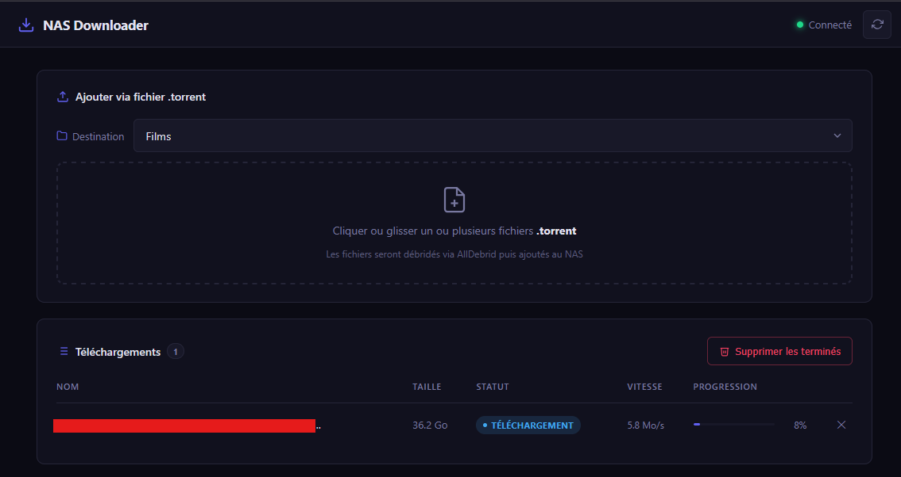

# NAS Downloader

Interface web pour envoyer des torrents sur un NAS Synology via AllDebrid.



Le torrent est uploadé sur AllDebrid qui le débrider et renvoie un lien direct, puis ce lien est transmis à Download Station sur le NAS.

## Stack

- **Backend** : Python 3 / Flask
- **Frontend** : HTML / CSS / JS vanilla
- **APIs** : AllDebrid, Synology Download Station

## Prérequis

- Un compte [AllDebrid](https://alldebrid.com) avec une clé API
- Un NAS Synology avec **Download Station** installé et activé
- Python 3.8+ (déploiement natif) ou Docker (dev)

## Installation

### Configuration

```bash
cp config/config.example.py config/config.py
```

Édite `config/config.py` et renseigne :
- L'adresse et les credentials de ton NAS
- Ta clé API AllDebrid
- Les dossiers de destination

### Docker (développement)

```bash
docker compose up -d --build
```

Ouvre `http://localhost:8080`

### Raspberry Pi (sans Docker)

Voir [INSTALL_RPI.md](INSTALL_RPI.md) pour le guide complet.

## Fonctionnalités

- Envoi de fichiers `.torrent` (sélection multiple, drag & drop)
- Choix du dossier de destination sur le NAS
- Suivi des téléchargements en temps réel
- Suppression individuelle ou en masse des tâches terminées
